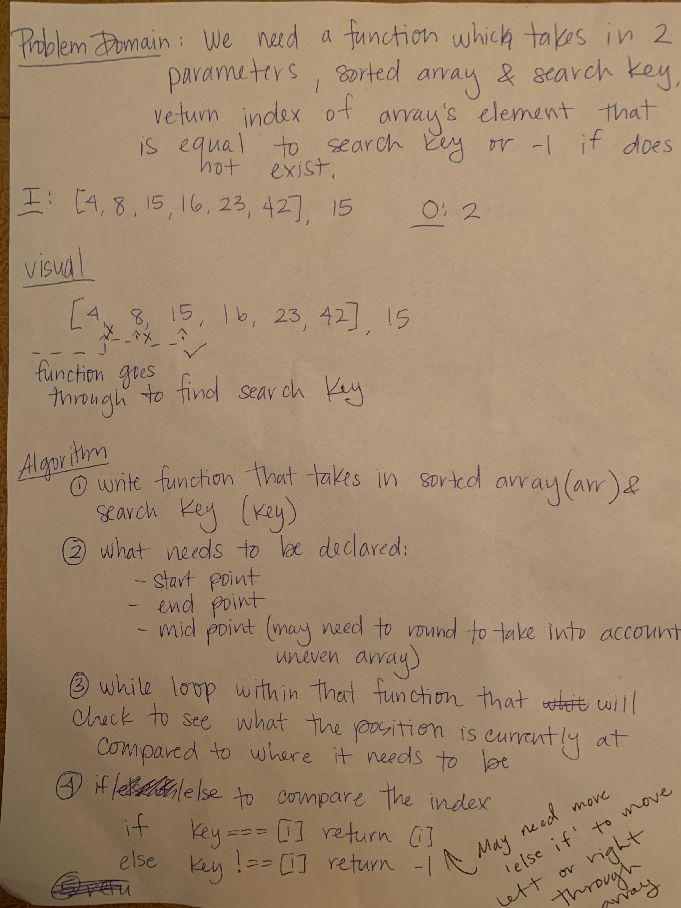

# Binary Search Array

## Challenge

Write a function which takes in 2 parameters, sorted arrays and search key, return index of array's element that is equal to the search key or -1 if it does not exist

## Approach & Efficiency

- Write a function that takes in a sorted array (arr) and a search key (key)
- What needs to be declared:
  1. Start Point
  2. End Point
  3. Middle Point
- While loop within that function that will check to see what position is currently at compared to where it needs to be at
- If/Else If to compare the index

## Solution

