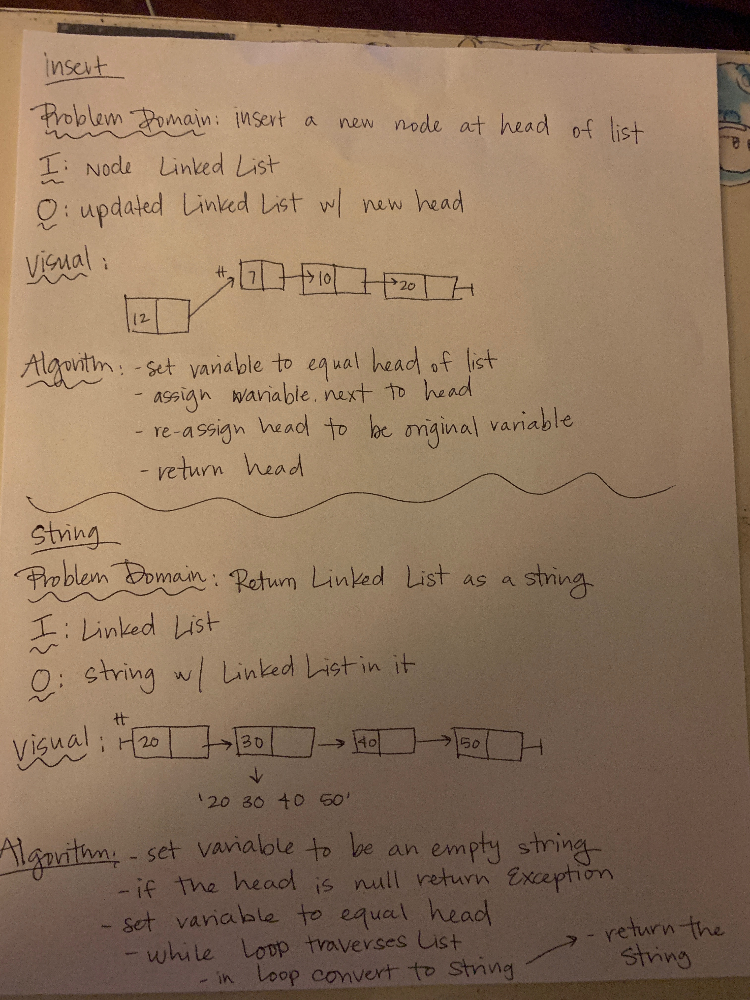
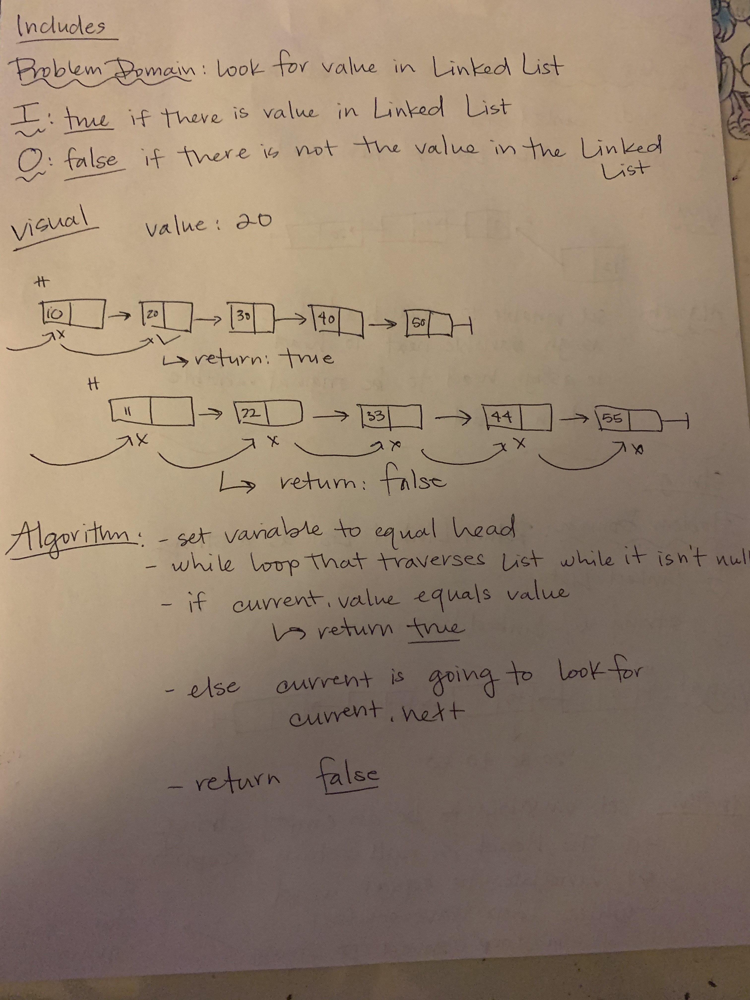

# LinkedList Insertions

## Challenge

### Challenge for Class 5 Code Challenge

Define a method called insert which takes any value as an argument and adds a new node with that value to the head of the list with an O(1) Time performance.
Define a method called includes which takes any value as an argument and returns a boolean result depending on whether that value exists as a Node’s value somewhere within the list.
Define a method called toString which takes in no arguments and returns a string representing all the values in the Linked List.

### Challenge for Class 6 Code Challenge

.append(value) which adds a new node with the given value to the end of the list
.insertBefore(value, newVal) which add a new node with the given newValue immediately before the first value node
.insertAfter(value, newVal) which add a new node with the given newValue immediately after the first value node

### Challenge for Class 7 Code Challenge

Write a method for the Linked List class which takes a number, k, as a parameter. Return the node’s value that is k from the end of the linked list. You have access to the Node class and all the properties on the Linked List class as well as the methods created in previous challenges.

### Challenge for Class 8 Code Challenge

Write a function called mergeLists which takes two linked lists as arguments. Zip the two linked lists together into one so that the nodes alternate between the two lists and return a reference to the head of the zipped list. Try and keep additional space down to O(1). You have access to the Node class and all the properties on the Linked List class as well as the methods created in previous challenges.

## Approach & Efficiency

### Approach for Class 5 Code Challenge

- Insert at head
  - create a new node
  - set node.next to be head
  - reassign head to current
  - return the head node
- Includes boolean
  - set current to be the head node
  - create a while loop to traverse the list when it isn't empty
    - if statement to see if the current value equals the value that you are looking for you
      - if it does then return true
    - else statement that sets current to current.next
      - return false
- String a Node List
  - set a variable to an empty string
    - if the the list is empty return an exception 
  - set a variable to equal the head node
    - while loop that turns list into a string
  - return the string

### Approach for Class 6 Code Challenge

- Made classes for Node and Linked List
- Append is going to look to see if there is a head, if there isn't then use that value as the head
- Insert Before goes through the linked list, if current is not null then look for value, if found append that new Value before the value you were looking for, if value isn't there return error
- Insert After goes through the linked list, if current is not null then look for value, if the value is found append new Value after that value, if value isn't there return error

### Approach for Class 7 Code Challenge

- Worked with Julie, Biniam and Enrique
- kthFromEnd is goig to set current to head and have a counter, if it can't find k then it is going to return an exemption, but if it is return the current value

### Approach for Class 8 Code Challenge

- create new empty linked list
- create a while loop that checks to see if list1 and list2 are null
- if statement that checks for list one
- else statement that checks for list two
- returns new linked list

## Solution

### White Board for Class 5 Code Challenge

### White Board for Class 6 Code Challenge

### White Board for Class 7 Code Challenge

### White Board for Class 8 Code Challenge

