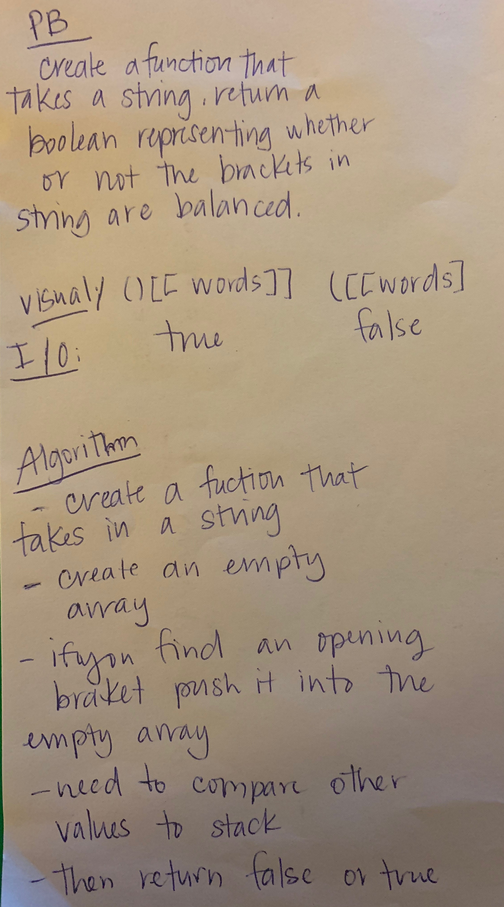

# Challenge

## Code Challenge Multi Bracket Array

## Problem

Your function should take a string as its only argument, and should return a boolean representing whether or not the brackets in the string are balanced. There are 3 types of brackets:

Round Brackets : ()
Square Brackets : []
Curly Brackets : {}

## Solution

- create a function that takes an imput
- create an empty array
- if you find an open bracket than push it into the array
- need to compare other values in the string to the array
- return false when there isn't a match
- return true if they all match

## White Board

